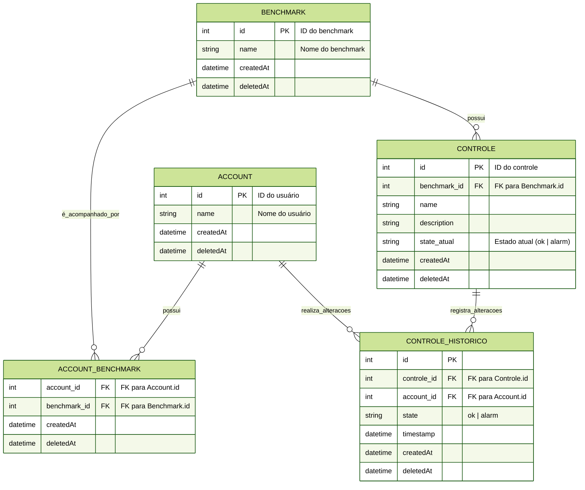

# Benchmarks por Account – Teste Rápido

> Supondo que sua máquina já tenha Docker instalado. Caso não tenha, instale antes de prosseguir:
> - Guia oficial de instalação: [https://docs.docker.com/get-docker/](https://docs.docker.com/get-docker/)


## 1. Pré-requisitos

### Docker Compose
1. Subir o ambiente:
```bash
docker compose up -d --build
```
- Isso cria o banco `benchmarks` já populado com contas, benchmarks, controles e histórico.

2. Acessar o PostgreSQL e executar os testes:
```bash
docker exec -it benchmarks-db psql -U user -d benchmarks
```
- Após acessar o `psql`, execute os SELECTs listados na Seção 4 (Q1, Q2 e Q3) para validar os dados, estados e históricos.

3. Parar o ambiente:
```bash
docker compose down
```

---

## 2. Estrutura do Banco de Dados

### Tabelas e Descrição
- **Account**  
  Armazena `id` e `name` dos usuários. Possui campos de criação (`createdAt`) e inativação (`deletedAt`).  
  Inativar não deleta do banco.

- **Benchmark**  
  Armazena `id` e `name` de um serviço. Também possui `createdAt` e `deletedAt`.

- **Account_Benchmark (FK)**  
  Tabela de junção N:M, porque um account pode ter vários benchmarks e um benchmark pode ter vários accounts. Possui `createdAt` e `deletedAt`.

- **Controle**  
  Armazena `id`, `name`, `description`, `benchmark_id` e `state_atual` (ok | alarm). Possui `createdAt` e `deletedAt`.

- **Controle_Historico**  
  Para registrar mudanças no controle. Campos: `id`, `controle_id`, `account_id` (quem realizou a mudança), `state`, `timestamp`, `createdAt` e `deletedAt`.

### Ideias para evolução do banco e monitoramento
- Criar controle de produto, para registrar valores ao longo do tempo.
- Monitorar consumo, para verificar frequência de pesquisa/requisição do produto.
- Captar dados de clientes e criar base de interesses.
- Gerar gráficos e análises baseados nos dados coletados.

---

## 3. Diagrama ER



---

## 4. Execução de Testes

### Q1 – Listar Benchmark com seus Controles e o estado atual para uma Account
```sql
SELECT 
    a.name AS account,
    b.name AS benchmark,
    c.name AS controle,
    c.state_atual
FROM Account a
JOIN Account_Benchmark ab ON ab.account_id = a.id
JOIN Benchmark b ON b.id = ab.benchmark_id
JOIN Controle c ON c.benchmark_id = b.id
WHERE a.id = 1; -- Troque pelo ID da conta
```

### Q2 – Listar Benchmark com seus Controles e as mudanças de estado em um intervalo
```sql
SELECT 
    a.name AS account,
    b.name AS benchmark,
    c.name AS controle,
    h.state,
    h.timestamp
FROM Account a
JOIN Account_Benchmark ab ON ab.account_id = a.id
JOIN Benchmark b ON b.id = ab.benchmark_id
JOIN Controle c ON c.benchmark_id = b.id
JOIN Controle_Historico h ON h.controle_id = c.id
WHERE a.id = 1
AND h.timestamp BETWEEN '2025-09-01' AND '2025-09-08'
ORDER BY h.timestamp;
```

### Q3 – Obter Benchmark com seus Controles e o estado em uma data/hora X (snapshot)
```sql
SELECT 
    a.name AS account,
    b.name AS benchmark,
    c.name AS controle,
    h.state,
    h.timestamp
FROM Account a
JOIN Account_Benchmark ab ON ab.account_id = a.id
JOIN Benchmark b ON b.id = ab.benchmark_id
JOIN Controle c ON c.benchmark_id = b.id
JOIN Controle_Historico h ON h.id = (
    SELECT h2.id
    FROM Controle_Historico h2
    WHERE h2.controle_id = c.id
    AND h2.timestamp <= '2025-09-05 10:00:00'
    ORDER BY h2.timestamp DESC
    LIMIT 1
)
WHERE a.id = 1; -- Troque pelo ID da conta

---